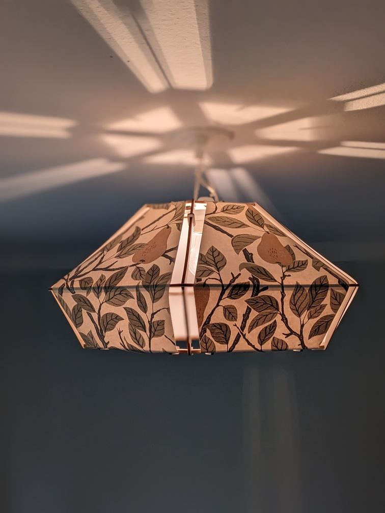

# Pear Lamp

This is the repository that contains the OpenSCAD files used to generate the
parts of my pear lamp.



## Details

This lamp is made of plywood for its armature, and wallpaper for it's shades.
Other materials may work, but might require some tweaking of the parameters of
the CAD model.

Material specifications:

+ Plywood: poppler, 4mm thick
+ Wallpaper: Non woven

## Building your own lamp

You can download the generated 2d files in the Release bundle. Alternatively,
you can generate them from scratch, see below.

You can use those files to build your own lamp. The lamp requires no glue nor
screws. The armature is built with parts that made with a laser cutter, and the
shades are made with a cutting machine (in this case, a Silhouette Cameo). The
shades can also be made by using a solid template (out of a rigid material)
and a hobbyist knife if you don't have a cutting machine available.

The files used to make the armature are the following:

+ `upper.dxf`: the upper plane of the lamp, that has a hole for the lighbulb
holder.
+ `middle.dxf`: the middle plane of the lamp
+ `lower.dxf`: the lower plane of the lamp
+ `connection.dxf`: the connecting arms that hold the planes together. 6 are
required.
+ `clamp.dxf`: small clamps to hold the shades to the aramature. 18 are used.

To make the shades, you can use the `shade.svg` file. (The Silhouette Cameo
worked better with a `svg` file.

## Generating the files from scratch

This project has only one hard dependency: [OpenSCAD](https://openscad.org/).

Open each file with OpenSCAD (see the list above), render the model with F7, and
then export to `dxf` or `svg` depending on your preference/needs.

You can also use GNU Make to generate all the files in one go:

``` shell
$ make release
```

## Modifying the Original Design

The lamp should be easy enough to modify and adapt to your taste. The file
`modules.scad` contains the size constants that you can change. For example,
the size of the different hexagonal planes, the width of the openwork between
the shades and the armature, the thickness of the plywood used, the radius of
the lamp holder, etc. There should be some comments on top of each constant to
help you understand what they change.

Pay attention that the model might break if you are using values that are too
different compared to the original model. Pay a special attention to the
`connection` module.

You might also want to tweak the tolerance used in the clamps depending on the
shades' material. That value is used to produce a tight fit between the plywood
and the wallpaper, to factor in the fact that the laser cutter is removing a bit
of material when cutting.

There's another value, used in the connecting arms for the same purpose, to
ensure a tight fit between the plywood interlocking pieces. You might want to
tweak it depending on the thickness and type of your material.

## Gallery


## License

This work is licensed under [CC-BY-SA-NC 4.0](https://creativecommons.org/licenses/by-nc-sa/4.0/)
